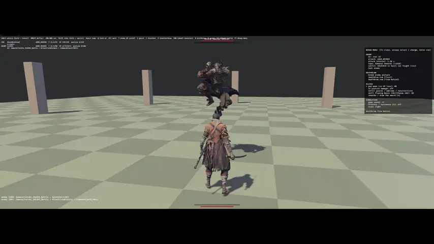

# Sv1

A sandbox that recreates how Wolf moves and fights in SEKIRO: SHADOWS DIE
TWICE, written in Rust on [Bevy](https://bevyengine.org) 0.19.

The characters are the game's own models, and what drives them is real too:
the timings, movement, animations, enemy AI and sounds are read from the
game's own files rather than tuned by eye.

[](https://github.com/FFwLo/RustSekiro/releases/download/v0.1.0/sv1-gameplay.mp4)

*Fighting the Ashina Samurai General: deflects, perilous attacks and a
deathblow. Click for the full video.*

This is a fan project for study. It is not affiliated with or endorsed by
FromSoftware or Activision. Nothing from the game is in this repository, only
code: to build and run it you need your own copy of the game, from which the
tools here generate the data.

## What is in it

### Movement

- Walk and run, each starting with the game's move-start animation and
  settling into its loop, with the stop animation in the direction you were
  moving.
- Sprint, by holding the step button.
- Lock-on: strafing around the target in four directions while facing it. On
  diagonals the legs turn toward where Wolf is going and the chest keeps
  facing the target, so the feet don't slide.
- Turning on the spot when locked on, and quick turns.
- Sheathing and drawing the sword, with its own walk and run while sheathed.

### Stepping and jumping

- Steps in four directions while locked on, leaning toward the stick.
- Jumps from a standstill and on the move. Locked on, they go forward, back,
  left or right while you keep facing the target.
- Steering in the air, landings, and the kick that bounces off an enemy into
  a second jump.
- Killed mid-jump, the body falls and lands instead of floating on.

### Combat

- The light-attack chain, with a held press turning into its thrust
  follow-up.
- Sprint, step, jump and air attacks, and attacks straight out of a deflect.
- Hits land when the blade itself reaches the target, not when the swing
  starts.
- Hit reactions by strength and direction: a flinch, a stagger, a blow that
  throws Wolf back, and a knockdown with its get-up.
- Death, and resurrection while there is a node left.

### Deflect and posture

- Guarding and deflecting with the game's own deflect window, including the
  shorter window when the button is spammed and the deflect that comes out of
  a block recoil.
- Blocked and deflected hits play the matching reaction for each attack
  strength, on the ground and in the air.
- Posture on both sides: damage from every hit, block and deflect, recovery
  that changes with what you are doing, and the posture break.
- Perilous attacks, and the Mikiri Counter against thrusts.
- The Flowing Water skill, toggled in the debug menu.

### Deathblows

- From the front after a posture break, from behind, sneaking up from
  behind, and plunging from above.
- Both characters are placed by the attachment points the game uses for
  each throw, and play their paired animations together.
- [docs/deathblow_groups.md](docs/deathblow_groups.md) lists which of the
  game's 70 enemies share Wolf's deathblow animations.

### Combat arts, prosthetic and items

Combat arts with their follow-ups, chosen in `config.toml`: Whirlwind Slash,
Ichimonji and Ichimonji: Double, Floating Passage, Nightjar Slash, and the
other arts' first slashes. Held arts sheathe, wait and draw-slash on release.
The Loaded Shuriken costs Spirit Emblems, and the Healing Gourd heals.

### The enemies

Two of them, picked in `config.toml` or the debug menu:

| Enemy | Weapon | Brain |
|---|---|---|
| Ashina Samurai General | katana, two-handed | its own battle script |
| Ochimusha | katana, one-handed | its own battle script |

Each runs **its real AI**: the game's own compiled battle scripts, run as they
ship in a small Lua 5.0 interpreter, on a runtime that answers their questions
about distance, angle, timers and effects the way the game does. They space,
attack, combo, guard, deflect and counter by those scripts, with their own
stats, attacks and reactions.

### The arena

A flat, tiled floor ringed by eight pillars, so the camera always has
something to frame.

### The debug menu

Press `F1`. From there you can:
- set the enemy's AI: its real AI, passive, perilous attacks only, one attack
  on repeat, or idle;
- change the enemy's type or outfit, and heal it;
- break its posture and deathblow it from the front or from behind;
- turn on god mode or infinite posture, refill items, and toggle Flowing
  Water;
- change the simulation speed, show hurtboxes, and reset.

### Visuals

- The game's models for Wolf and the enemies. Each part uses the texture its
  material definition names, and a custom shader reads Sekiro's normal,
  shininess and metal maps.
- Cloth simulated from the game's own cloth data: scarves, robes, armour
  skirts and ropes, colliding with the body.
- Animation crossfades timed by the animations themselves. Some actions play
  on the upper body over moving legs, and the head and torso turn toward the
  target.
- The sword and scabbard sit where the game's weapon params put them, and
  move to the hand or hip when an animation asks for it.

### Sound (optional)

With the game's FMOD runtime available, the sandbox plays the game's own
sounds through it: footsteps, cloth and armour, swings, hits, blocks and
deflects. They come on the frames the animations call for them, chosen by the
same material tables the game uses. Without FMOD it falls back to decoded
samples, or runs silent.

## How faithful it is

Read from the game's files:

- Every action's length, hit windows, cancel windows and input windows.
- Root motion for every action, and walk, run and sprint speeds.
- Deflect and guard windows, posture damage and recovery, attack and damage
  params, and the reactions they cause.
- Deathblow geometry: distances, attachment points and timing.
- Wolf's behaviour rules, from the decompiled character script, and the
  enemies' AI, from their compiled battle scripts.
- Camera distances, angles and chase rates.
- The skeletons, animations, models, materials and cloth.
- Which sounds each animation plays and on which frame.

Checked against the running game with a read-only recorder: jump arcs, run
speed, deflect and input windows, posture costs and recovery, and the
General's deathblow positions frame by frame.

Still estimated (all marked `gap` in the code and explained in `config.toml`):

- The floor's sound material. The real one comes from the level, which the
  sandbox doesn't have, so cobblestone stands in.
- Wolf's body radius for pushing against the enemy.
- How long the deathblow window stays open after a break.
- A few camera details.

Some things are inferred from the data rather than read directly. Three
inferences worth knowing about:

- The sheathed walk and run are the `a010` animation set, which only appears
  next to the normal set; nothing in the files names it "sheathed".
- A character texture's alpha is treated as a cut-out, except on skin and
  eyes, whose alpha means something else. The rule comes from what the
  textures contain, not from a flag the game stores.
- Shininess becomes roughness as one minus the stored value. Sekiro's own
  lighting model isn't reproduced.

Not included: levels, stealth, the grappling hook, most prosthetics, and any
enemy beyond the two above. Feet aren't pinned to the ground (the game uses
foot IK), so a straight run slips a little, and Sekiro's fabric-detail layers
and skin shading are not drawn.

Sound is not positional. Where the game picks a footstep sound from the
floor, the sandbox uses cobblestone (`FLOOR_MATERIAL` in `src/sound.rs`).

## Controls

| Action | Keyboard / mouse |
|---|---|
| Move / look | WASD / mouse |
| Walk | Left Alt or Left Ctrl |
| Attack (hold for the thrust) | Left click or J |
| Guard / deflect | Right click or K |
| Combat art | Left and right click together |
| Step (hold to sprint) | Shift |
| Jump, kick in the air | Space |
| Lock on | Q |
| Shuriken | F |
| Healing Gourd | E |
| Sheathe / draw | X |
| Resurrect (when dead) | Left click |

Sandbox keys: `F1` opens the debug menu, `T` turns the enemy's AI on or off,
`H` shows hurtboxes, `R` resets, `F5` reloads `config.toml`, `Esc` releases
the mouse. Click the window to capture the mouse.

## Setup

### From a release

Download `Sv1-<version>-windows.zip` from
[Releases](https://github.com/FFwLo/RustSekiro/releases), unzip it
anywhere, and in that folder:

1. Run `extract.bat`, or `extract.bat -Sekiro "D:\path\to\Sekiro"` for a
   non-default install. It builds the `extracted` folder from your copy of the
   game; the sound step takes the longest.
2. Run `sv1.exe`.

You need Windows and SEKIRO: SHADOWS DIE TWICE from Steam (patch 1.06).
Nothing else.

### From source

You need Rust and Windows, and SEKIRO: SHADOWS DIE TWICE from Steam (patch
1.06). Python 3 is only needed for the analysis tools.

Generated files are deliberately not in the repository, because they are
derived from the game: everything in `extracted/`. The project will not run
until you generate it from your own copy. That is one command.

1. **Tell the tools where the game is.** The script takes one parameter:

   | Parameter | Points at | Default |
   |---|---|---|
   | `-Sekiro` | the game's install folder | the default Steam location |

2. **Generate the data.** The extractor decrypts the game's archives itself,
   so no other unpacking tool is needed:

   ```powershell
   powershell -ExecutionPolicy Bypass -File tools\extract.ps1
   ```

   It reads the params, animations, models, materials, cloth and sounds into
   `extracted/`. The sound step decodes through the game's own FMOD and takes
   the longest.

3. **Run it** from the project folder:

   ```bash
   cargo run --release
   ```

After that the game is no longer needed to play, only to regenerate the data.
Run `tools\extract.ps1` again after pulling changes that touch `tools/`. It
runs the extractor's steps, which can also be run on their own:

```bash
cargo run --release --manifest-path tools/sekiro-extract/Cargo.toml -- unpack "<Sekiro folder>" extracted "<regex>"
```

```bash
cargo run --release --manifest-path tools/sekiro-extract/Cargo.toml -- params extracted/param/gameparam/gameparam.parambnd.d extracted/json/params
```

```bash
cargo run --release --manifest-path tools/sekiro-extract/Cargo.toml -- export extracted
```

```bash
cargo run --release --manifest-path tools/sekiro-extract/Cargo.toml -- model <flver> <tpf> extracted/model_<name>.bin extracted/tex
```

The behaviour tests run with `cargo test --release`. Values the game files
don't contain live in `config.toml`, each with where the real value would come
from. `F5` reloads it while playing.

## Layout

| Path | What it is |
|---|---|
| `src/player.rs` | Wolf: the input buffer, the state machine from the character script, movement, guard and deflect, jumps, deathblows. |
| `src/enemy.rs` | The enemies: their actions, reactions, guarding and deflecting, and their side of a deathblow. |
| `src/ai.rs`, `src/ai/lua50.rs` | The Lua 5.0 interpreter and goal runtime that run the enemies' real battle scripts. |
| `src/combat.rs`, `src/actor.rs` | Hits, posture, damage, reactions, knockback, root motion. |
| `src/anim.rs` | Animation playback: crossfades, layers, loops, leg twist, head and torso turns. |
| `src/model.rs`, `src/sekiro_material.wgsl` | Models, weapons and where they sit, and the material shader. |
| `src/cloth.rs` | Cloth simulation from the game's cloth data. |
| `src/sound.rs`, `src/fmod.rs` | Sound events from the animations, played through the game's FMOD. |
| `src/camera.rs`, `src/hud.rs`, `src/debug_menu.rs`, `src/world.rs` | Camera, HUD, debug menu and arena. |
| `src/prosthetic.rs` | The Loaded Shuriken. |
| `src/sim_tests.rs` | Behaviour tests; run with `cargo test`. |
| `src/trace.rs`, `src/photo.rs` | A scripted run that logs every drawn frame, and a screenshot mode, for checking animation. |
| `config.toml` | Values the game files don't hold, each with where its real value lives. |
| `tools/extract.ps1` | Generates `extracted/` from your copy of the game. |
| `tools/sekiro-extract/` | The extractor: archives, params, animation and behaviour files, models, materials, cloth, sound banks. |
| `tools/trace_pops.py`, `tools/trace_slide.py` | Find animation pops and foot sliding in a trace. |
| `tools/memscope/` | The read-only recorder used to check timings against the running game. |
| `docs/` | Progress log and a knowledge base per topic: what each mechanic is and where in the game data it was found. |

## A note on the data

`extracted/` is derived from the game's files, so none of it is committed and
it is in `.gitignore`. Please keep it that way in forks: share the code, and
let each person generate the data from the copy of the game they own.

The archive keys and file-name list in `tools/sekiro-extract/keys/` are the
ones the community already distributes with its unpacking tools.

## License

The code is under the [MIT License](LICENSE.md).

`src/ai/lua50.rs` is adapted from [sekiro-rs](https://github.com/AKJama/sekiro-rs)
(Copyright (c) 2026 AKJama), used under its MIT license; the notice is in
[THIRD_PARTY.md](THIRD_PARTY.md).

The licence covers this project's code only. It grants nothing over SEKIRO:
SHADOWS DIE TWICE or anything generated from its files, which remain
FromSoftware's and Activision's.
